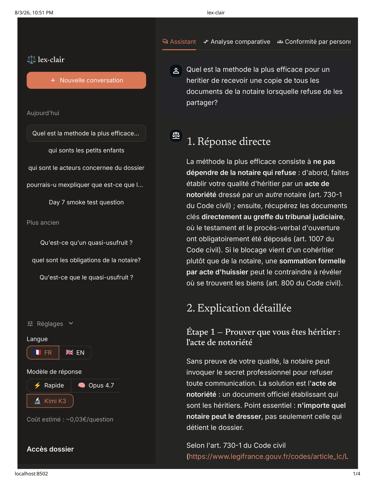
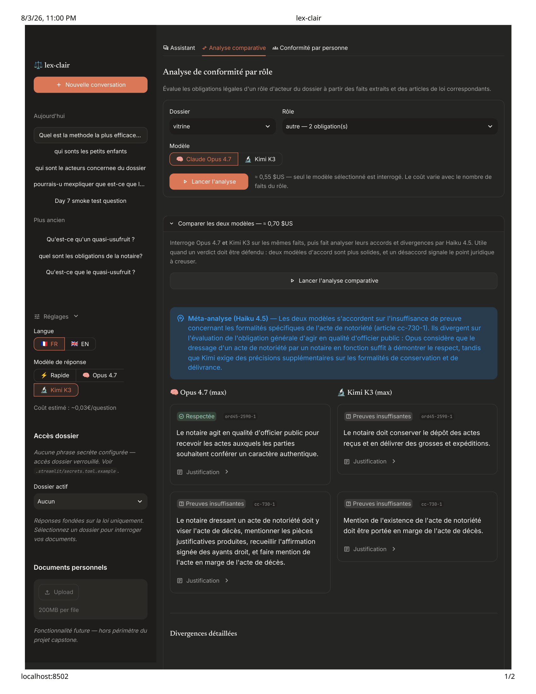
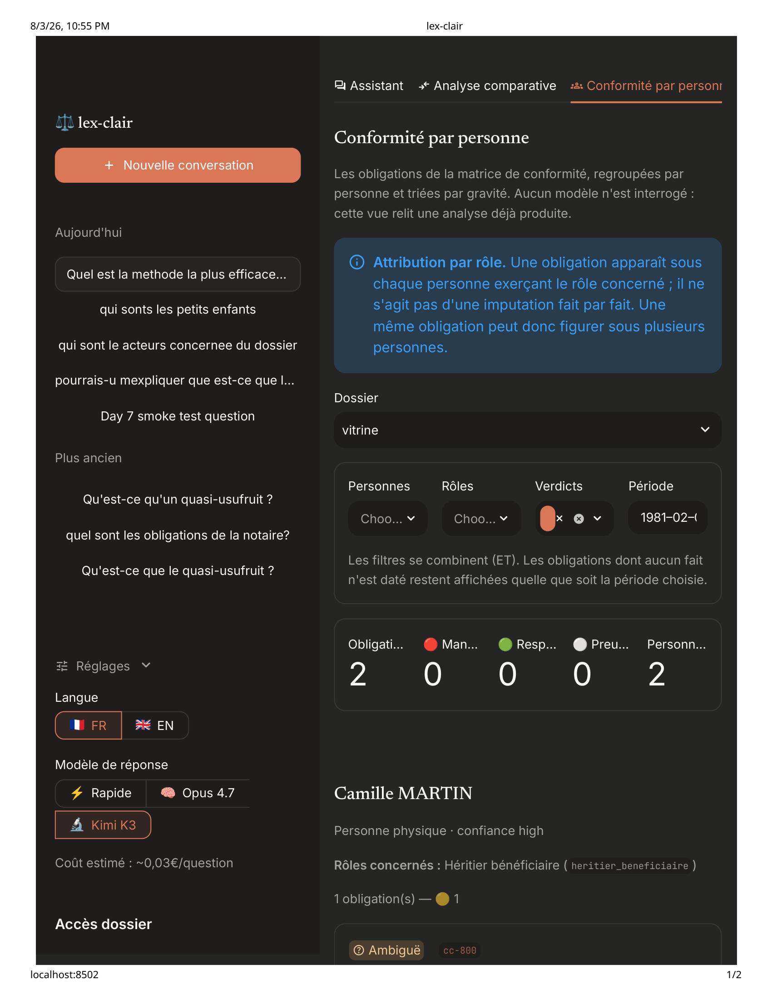
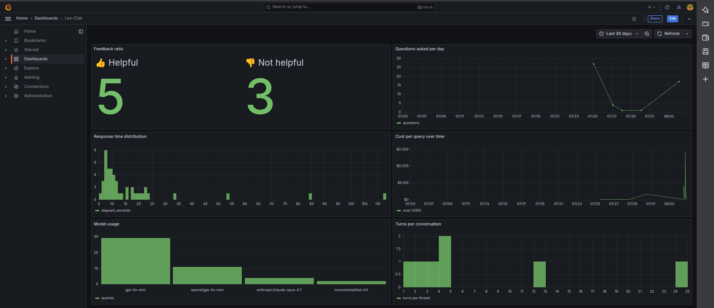

U7# lex-clair — a legal investigator for succession heirs

**A French legal RAG that decodes notaire correspondence, cites the applicable statutes verbatim, and turns a shoebox of documents into an evidence file.**

[](https://opensource.org/licenses/MIT)
[](https://www.python.org/downloads/release/python-3120/)
[](https://github.com/DataTalksClub/llm-zoomcamp)

> **Not legal advice.** lex-clair is a decision-support tool for non-lawyers navigating French succession law. It cites statutes and analyzes documents; it does not replace a licensed attorney. See the [disclaimer](#not-legal-advice).

---

## The problem

French succession law is a jargon labyrinth built for professionals. When a relative dies leaving a complex estate — quasi-usufruit conventions, démembrement across SCPI shares, mandats between heirs, notarial acts written in 19th-century French — the heirs are lost. The notaire is supposed to be neutral. Sometimes they aren't. Sometimes they exploit the asymmetry: refuse to release the dossier, cite articles the heirs can't verify, restate positions in successive letters until nobody can follow the thread.

lex-clair started from a real litigation where obfuscation was the norm. The heirs had a shoebox of PDFs, screenshots, and email chains. What they needed was:

1. A tool that reads the shoebox and identifies **who did what, when, and to whom**.
2. A tool that cites the applicable statutes **in plain language**, so the heirs can verify each claim.
3. A tool that flags **where the notaire's conduct diverges from what the law actually requires**.
4. A file structured well enough that a lawyer treats it as a case, not a "shoe-box mess."

That's what lex-clair does.

---

## What lex-clair does

Three connected surfaces, one legal knowledge base:

**1. Assistant — plain-French Q&A over French succession law.** Ask any question ("qu'est-ce qu'un quasi-usufruit ?", "quels sont mes recours si le notaire refuse de me remettre le dossier ?"). Get a structured answer with cited statute articles, direct links to Légifrance, and a fluency-appropriate explanation.

**2. Analyse comparative — dual-model verdict on a role's compliance.** For a role in the dossier (e.g., `notaire_redacteur`), lex-clair runs both Claude Opus 4.7 max and Kimi K3 max in parallel over the same facts + same statute chunks, then uses Haiku 4.5 as a meta-analyst to identify agreement, divergence, and the crux of any split. Legal verdicts that both frontier models agree on are more defensible; divergences flag interpretive uncertainty.

**3. Conformité par personne — person-grouped compliance dashboard.** The compliance matrix is regrouped around real named individuals ("Maître CORBEAU"), not opaque role identifiers ("notaire_redacteur"). Filterable by person, role, verdict, and date. Each entry shows the obligation, the responsible person, the dated evidence, the cited statute article, and the model's rationale — ready to hand a lawyer.

---

## Screenshots

| | |
|---|---|
|  |  |
| **Assistant** — legal Q&A with cited articles and Légifrance links | **Analyse comparative** — Opus 4.7 vs Kimi K3 side-by-side with Haiku meta-analysis |
|  |  |
| **Conformité par personne** — filterable, person-grouped compliance matrix | **Grafana** — 6-panel dashboard: feedback ratio, questions/day, response time, cost, model usage, turns per conversation |

**Full walkthrough**: [`docs/screenshots/lex-clair_Question_-example.pdf`](docs/screenshots/lex-clair_Question_-example.pdf) — 4-page real Q&A output on the question *"Quelle est la méthode la plus efficace pour un héritier de recevoir une copie de tous les documents de la notaire lorsqu'elle refuse de les partager ?"*

---

## Architecture

lex-clair is organized around **four planes**. File-tree membership equals plane membership; cross-plane imports are limited to defined contracts.

```
┌─────────────────────────────────────────────────────────────────────┐
│  Plane I — Ingestion (offline)                        ingestion/    │
│  • Statute corpus: PISTE API (Légifrance) → chunks + BM25 + Chroma  │
│  • Dossier pipeline: PDF → VLM → facts → mentions → persons → …     │
└──────────────────────────┬──────────────────────────────────────────┘
                           │  load_index()
┌──────────────────────────▼──────────────────────────────────────────┐
│  Plane II — RAG flow (online)                                rag/   │
│  • Q&A: router → rewrite → retrieve → rerank → generate             │
│  • Compliance: matrix (single-model) OR compare (dual-model)        │
└──────────────────────────┬──────────────────────────────────────────┘
                           │
      ┌────────────────────┴─────────────────────┐
      ▼                                          ▼
┌────────────────────┐              ┌────────────────────────────────┐
│  Plane III         │              │  Plane IV — UI & Ops           │
│  Measurement       │              │              app/, monitoring/ │
│  eval/             │              │  Streamlit UI, Postgres +      │
│  retrieval + LLM   │              │  Grafana 6-panel dashboard     │
│  judge diversity   │              │                                │
└────────────────────┘              └────────────────────────────────┘
```

Design decisions are recorded chronologically in [`docs/decisions.md`](docs/decisions.md) as ADRs. There are 41 numbered ADRs (#27–#62) plus 12 pre-numbered dated entries covering everything from "why Streamlit and not FastAPI" to "why we uncapped `MAX_OUTPUT_TOKENS` on the compliance call."

---

## What ships — features mapped to rubric criteria

| Rubric criterion | How lex-clair earns it |
|---|---|
| **Problem description** | This README's [problem section](#the-problem); real litigation origin. |
| **Retrieval flow** | Hybrid RRF (BM25 + BGE-M3) → BGE-reranker → answer generation with cited chunks. See [`rag/retrieve.py`](rag/retrieve.py) + [`rag/flow.py`](rag/flow.py). |
| **Retrieval evaluation** | Multiple configurations tested (`vector_only`, `bm25_only`, `hybrid`) across [`data/retrieval_eval_results.csv`](data/retrieval_eval_results.csv). See [evaluation](#evaluation). ADR #20. |
| **LLM evaluation** | Three provider-diverse judges (GPT-4o-mini, Claude Haiku 4.5, Mistral Small). Judge-diversity finding documented. See [`data/llm_eval_results.csv`](data/llm_eval_results.csv). |
| **Interface** | Streamlit with three tabs (Assistant, Analyse comparative, Conformité par personne), model toggle, language toggle, passphrase-gated dossier access. |
| **Ingestion pipeline** | Fully automated: `python -m ingestion.build` for statutes; `python -m ingestion.dossier.build` for dossiers. Both idempotent, both cached. |
| **Monitoring** | Grafana dashboard with 6 panels: feedback ratio, questions/day, response time, cost/query, model usage, turns per conversation. Postgres-backed conversation log. |
| **Containerization** | `docker-compose.yml` for Postgres + Grafana. App runs locally (Streamlit + Python). |
| **Reproducibility** | See [Setup](#setup). Pinned versions in `pyproject.toml` + `uv.lock`. Docker services pinned. Vitrine (anonymized demo) case shipped for reviewers. |
| **Best practices — hybrid search** | RRF fusion of BM25 + vector implemented in `rag/retrieve.py::HybridRetriever`. |
| **Best practices — reranking** | BGE-reranker-v2-m3 cross-encoder in `rag/rerank.py`. |
| **Best practices — query rewriting** | GPT-4o-mini rewrites for retrieval only (original query used for generation) in `rag/rewrite.py`. |
| **Bonus — adversarial evaluation** | Dual-model comparative (`--compare`) between Opus 4.7 and Kimi K3 with Haiku meta-analysis. ADR #56. |

---

## Setup

### Prerequisites

- **Python 3.12** — required (uses modern typing features)
- **[uv](https://docs.astral.sh/uv/)** for package management
- **Docker + docker-compose** for Postgres + Grafana
- **OpenRouter API key** — all LLM calls route through OpenRouter (unified credit pool). Get one at [openrouter.ai](https://openrouter.ai/)
- **PISTE API credentials** — only needed if you want to re-fetch the statute corpus. The corpus CSVs are checked in, so most users skip this. Register at [piste.gouv.fr](https://piste.gouv.fr/)

### 1. Clone and install

```bash
git clone https://github.com/neigelspain-boop/llm-capstone_lex-clair.git
cd llm-capstone_lex-clair
git checkout v2-persons   # Attempt 2 submission branch

uv sync
```

### 2. Environment variables

Copy the example env file and fill in real values:

```bash
cp .env.example .env
# then edit .env
```

Required variables:

| Variable | Purpose | Required for |
|---|---|---|
| `OPENROUTER_API_KEY` | All LLM calls | Everything |
| `PISTE_CLIENT_ID` | Légifrance OAuth2 | `ingestion.build` (only if re-fetching) |
| `PISTE_CLIENT_SECRET` | Légifrance OAuth2 | `ingestion.build` (only if re-fetching) |
| `POSTGRES_HOST` | Persistence DB | Monitoring/UI |
| `POSTGRES_PORT` | Persistence DB (default 5432) | Monitoring/UI |
| `POSTGRES_DB` | Persistence DB name | Monitoring/UI |
| `POSTGRES_USER` | Persistence DB user | Monitoring/UI |
| `POSTGRES_PASSWORD` | Persistence DB password | Monitoring/UI |

Optional toggles (all default to `true`):

| Variable | Purpose |
|---|---|
| `LEXCLAIR_ENABLE_ROUTER` | Query router (Haiku 4.5) that auto-selects source scope |
| `LEXCLAIR_ENABLE_REWRITE` | LLM query rewriting before retrieval |

### 3. Streamlit dossier passphrase

Dossier access in the UI is gated behind a passphrase (private cases stay private):

```bash
cp .streamlit/secrets.toml.example .streamlit/secrets.toml
# then edit .streamlit/secrets.toml to set your passphrase
```

### 4. Start services

```bash
docker-compose up -d
# postgres:16-alpine on :5432
# grafana:11.2.0 on :3000
```

Wait ~10s, then initialize the DB schema:

```bash
uv run python -m monitoring.migrate --up
```

Verify Grafana at `http://localhost:3000` (default admin/admin; change in production). The lex-clair dashboard is auto-provisioned from `monitoring/grafana/dashboards/lexclair.json`.

### 5. (Optional) Refresh the statute corpus

The 792 statute chunks and Chroma index are pre-built and included in the repo. Only run this if you want to re-fetch from Légifrance:

```bash
uv run python -m ingestion.build
```

### 6. (Optional) Ingest a dossier

The `vitrine` case (anonymized demo) is included. To ingest your own dossier:

```bash
# Drop your PDFs under data/dossier/YOURCASE/raw/
uv run python -m ingestion.dossier.build --case-id YOURCASE
# Extraction → gate → facts → index. Idempotent, cached.

# Then the Attempt 2 pipeline stages:
uv run python -m ingestion.dossier.distill  --case-id YOURCASE
uv run python -m ingestion.dossier.mentions --case-id YOURCASE
uv run python -m ingestion.dossier.resolve  --case-id YOURCASE
```

### 7. Run the app

```bash
uv run streamlit run app/streamlit_app.py
# → http://localhost:8501
```

Or the pure CLIs:

```bash
# One-shot Q&A
uv run python -m rag.flow "Qu'est-ce qu'un quasi-usufruit ?"

# Full compliance matrix (single-model, Opus 4.7 max)
uv run python -m rag.compliance --case-id vitrine

# Dual-model comparative on one role
uv run python -m rag.compliance --case-id vitrine --role-id notaire_redacteur --compare
```

---

## Ingestion pipeline

### Statute corpus (`ingestion/`)

Data source: **PISTE API (Légifrance)** via OAuth2. Scope defined by `data/corpus_manifest.yaml`:

- **Code civil** (LEGITEXT000006070721): 5 sections including successions (art. 720-767), acceptation-renonciation (art. 768-782), rapports & réductions (art. 921-930-5), testaments (art. 967-980)
- **Code du notariat** (LEGITEXT000006074237): 6 sections
- **Ordonnance 45-2590** (statut du notariat): 8 sections
- **Décret 71-941** (actes notariés): 4 sections
- **Décret 73-609** (formation professionnelle notariale): 3 sections
- **Règlement Intérieur National des notaires** (LEGITEXT000021995525): 2 sections
- **Décret 78-262** (tarifs): 1 section

Total: **~792 article-level chunks** (`data/chunks.csv`), indexed in ChromaDB with BGE-M3 embeddings and a parallel BM25 index for hybrid retrieval.

### Dossier pipeline (`ingestion/dossier/`)

For a user-uploaded case:

```
raw/*.pdf
   │
   ▼   extract.py  (Qwen3-VL vision + pdfplumber fallback)
extracted/*.md          verbatim per-page markdown, no paraphrase
   │
   ▼   gate.py  (Haiku 4.5 faithfulness check)
   │             rejects hallucinated content
   ▼   facts.py  (Gemini 2.5 flash-lite)
facts.jsonl             atomic legal facts with actor_role, target, dated verbatim_quote
actor_roles.jsonl       discovered role catalog per case
role_ambiguities.jsonl  flagged uncertain roles
   │
   ▼   distill.py  (Haiku 4.5) — ADR #52
facts.jsonl.distilled_context   dense per-fact substance summary
   │
   ▼   mentions.py  (Haiku 4.5) — ADR #54
_mentions/*.json        per-doc named-entity mentions
   │
   ▼   resolve.py  (Haiku 4.5) — ADR #55
persons.jsonl           case-scoped canonical persons with dated role_assignments
   │
   ▼   anonymize.py  (deterministic) — ADR #59, #62
data/dossier/vitrine/   anonymized artifacts for public demo
```

Every stage is **idempotent** (content-hashed caches short-circuit re-runs) and **atomic** (`.tmp` → `os.replace`). Stages read only inputs from the prior step; no cross-plane leakage.

---

## Evaluation

### Retrieval

Ground truth: **200 synthetic queries** derived from statute chunks via GPT-4o-mini (ADR #17). Configurations swept in `eval/retrieval_eval.py`:

<!-- FILL: Verify against your local data/retrieval_eval_results.csv. Sonnet's report indicated vector_only ships. -->

| Configuration | Hit Rate @5 | MRR @5 | Recall @5 |
|---|---|---|---|
| **vector_only + rerank** *(shipped)* | 0.47 | 0.29 | 0.47 |
| bm25_only + rerank | *see CSV* | *see CSV* | *see CSV* |
| hybrid RRF + rerank | *see CSV* | *see CSV* | *see CSV* |

**Counter-intuitive finding (ADR #20)**: `vector_only` outperformed `hybrid`. Root cause: the synthetic ground truth was de-lexicalized (queries paraphrase the article rather than quote it), which suppressed BM25 signal. Rather than gaming the eval, we documented the finding honestly and shipped the config that actually won on this ground truth. The hybrid path stays in the code for real user queries — where lexical match matters more.

Retrieval pipeline: `k=20` retrieved → BGE-reranker-v2-m3 → `k=5` used for generation.

### LLM-as-judge

**300 query-answer pairs** (100 per judge) evaluated across three provider-diverse judges to avoid single-judge bias:

<!-- FILL: verify agreement/accuracy numbers from data/llm_eval_results.csv -->

| Judge | Provider | Role |
|---|---|---|
| `openai/gpt-4o-mini` | OpenAI | Cheap first-pass check |
| `anthropic/claude-haiku-4.5` | Anthropic | **Production judge** (best discrimination) |
| `mistralai/mistral-small-2603` | Mistral | French-native perspective |

**Judge-diversity finding (Day 5)**: GPT-4o-mini and Mistral Small showed grade inflation on French legal RAG (~90%+ relevance ratings for weak answers). Claude Haiku 4.5 discriminated meaningfully — flagged confabulation, over-broad citations, and missing verbatim anchoring. Single-judge evaluation would have materially overstated system quality. Documented in ADR #26 predecessor + reflected in the production judge choice.

---

## Monitoring

Postgres 16 stores every conversation turn (question, answer, model used, cost, feedback). Grafana dashboard at `http://localhost:3000` visualizes:

| Panel | What it shows |
|---|---|
| **Feedback ratio** | Thumbs-up vs thumbs-down count |
| **Questions asked per day** | Volume time series |
| **Response time distribution** | Histogram of elapsed_seconds per query |
| **Cost per query over time** | Real USD cost from OpenRouter usage receipts |
| **Model usage** | Which answer model users pick (gpt-4o-mini / opus-4.7 / kimi-k3) |
| **Turns per conversation** | Distribution of conversation depth |

Dashboard is auto-provisioned from `monitoring/grafana/dashboards/lexclair.json`. See [`docs/screenshots/grafana_dashboard.png`](docs/screenshots/grafana_dashboard.png).

---

## Attempt 1 → Attempt 2 delta

**Attempt 1 (`main`, tag `attempt-1-baseline`)**: statute-only Q&A RAG. Hybrid retrieval, reranker, three-judge eval, Streamlit UI with feedback, Postgres persistence, Grafana dashboard. 17 rubric points locked as fallback.

**Attempt 2 (`v2-persons`, this submission)**: everything from Attempt 1 **plus**:

- **Dossier ingestion** (`ingestion/dossier/`): PDF → extraction → gate → facts → mentions → resolve → distill. Ships full pipeline for real user cases. ADRs #35, #37, #38, #52, #54, #55.
- **Compliance matrix** (`rag/compliance.py`): per-role gap analysis between statute obligations and dossier facts. Emits `compliance_matrix.json` with met/breached/insufficient/ambiguous verdicts, evidence fact_ids, statute citations, and person names. ADR #43.
- **Person index**: mentions → resolve pipeline produces `persons.jsonl` with canonical names, aliases, and dated `role_assignments`. Enables "who did what" instead of "which role_id did what." ADR #55.
- **Fact-level distillation**: each fact gets a `distilled_context` alongside `verbatim_quote`. Compliance reasons from distilled, verifies against verbatim before finalizing verdicts (fiability constraint). ADR #52, #53.
- **Dual-model comparative** (`--compare`): Opus 4.7 max + Kimi K3 max on identical inputs, with Haiku 4.5 divergence meta-analysis. On-demand per role. ADR #56.
- **Passphrase-gated dossier access** in Streamlit: private cases stay behind a passphrase; public reviewers see the anonymized `vitrine` case. ADR #58.
- **Anonymization pipeline** (`ingestion/dossier/anonymize.py`): produces the shippable `vitrine` case by replacing real names with pinned personas. Dates and amounts pass through unchanged — deliberately, so the published figures still add up against the deed they quote. ADR #59, #62.
- **Two substitution registers**: personas (ordinary French names) for the published dossier, role designations (`notaire_instrumentaire`) for the published investigation transcript, which already argues by function. `--step scrub` repairs an already-derived case in place when a PII pattern is strengthened. ADR #78.

Full commit history: 32 commits on `v2-persons` beyond Attempt 1's baseline.

---

## Best practices

**Hybrid retrieval** with RRF fusion of BM25 and BGE-M3 dense vectors. Implementation in `rag/retrieve.py::HybridRetriever`. Even though `vector_only` won on synthetic ground truth (ADR #20), the hybrid path stays in the code for real user queries.

**Cross-encoder reranking** with BGE-reranker-v2-m3 in `rag/rerank.py`. Retrieval fetches `k=20`, reranker keeps top `k=5`.

**LLM query rewriting** for retrieval only (original query used for generation to avoid drift). GPT-4o-mini rewrites in `rag/rewrite.py`. Silent-fallback on failure.

**Cross-model verification** for high-stakes legal verdicts. `--compare` runs two frontier reasoning models on identical inputs; a third model (Haiku 4.5) meta-analyzes agreement and divergence. Rubric evidence for adversarial evaluation.

**Fiability constraint** in compliance prompts (ADR #53): compliance model reads both `distilled_context` (dense reasoning input) and `verbatim_quote` (forensic anchor). Before finalizing a `breached` or `met` verdict, the prompt requires cross-checking that verbatim supports the reasoning. On mismatch → downgrade to `insufficient_evidence`. Explicitly guards against verdict fabrication.

**Judge diversity** for evaluation. Three provider-diverse judges (OpenAI, Anthropic, Mistral) avoid single-judge inflation.

**Provenance-preserving pipeline**. Every fact retains a `verbatim_quote` traceable to a source PDF page. Every compliance verdict names specific `evidence_fact_ids`. The heir (and their lawyer) can walk any conclusion back to the source document.

---

## Model palette

All LLM calls route through **OpenRouter** (unified credit pool, single client factory `ingestion.clients.get_openrouter_client`). Model provider diversity is preserved by routing GPT + Anthropic + Mistral + Google + Moonshot through the same OpenAI-compatible interface. ADR #40.

| Purpose | Model | Reasoning effort |
|---|---|---|
| Default answer generation | `openai/gpt-4o-mini` | no |
| Answer generation (opt-in, "deep think") | `anthropic/claude-opus-4.7` | max |
| Answer generation (opt-in, alternative) | `moonshotai/kimi-k3` | max |
| Query router | `anthropic/claude-haiku-4.5` | no |
| Query rewriting | `openai/gpt-4o-mini` | no |
| Dossier vision extraction | `qwen/qwen3-vl-235b-a22b-instruct` | — |
| Dossier faithfulness gate | `anthropic/claude-haiku-4.5` | no |
| Fact extraction | `google/gemini-2.5-flash-lite` | no |
| Mention extraction | `anthropic/claude-haiku-4.5` | no |
| Person resolution | `anthropic/claude-haiku-4.5` | no |
| Fact distillation | `anthropic/claude-haiku-4.5` | no |
| Compliance matrix | `anthropic/claude-opus-4.7` | max |
| Compliance comparative (alternative) | `moonshotai/kimi-k3` | max |
| Divergence meta-analysis | `anthropic/claude-haiku-4.5` | no |
| Eval judges | `openai/gpt-4o-mini` + `anthropic/claude-haiku-4.5` + `mistralai/mistral-small-2603` | no |

**OpenRouter transport patterns**: reasoning effort via `extra_body={"reasoning": {"effort": "max"}}` (top-level `reasoning=` kwarg is rejected by the SDK). Kimi K3 slug is `moonshotai/kimi-k3` — the missing `ai` in `moonshot/kimi-k3` returns 404. Reasoning and completion tokens share the same `max_tokens` budget on Opus max — this is why the compliance call is uncapped (ADR #49).

---

## Project structure

```
llm-capstone_lex-clair/
├── app/                            # Plane IV — UI
│   └── streamlit_app.py            # 3-tab Streamlit: Assistant / Analyse comparative / Conformité par personne
├── data/                           # Plane I & III artifacts
│   ├── articles.csv                # 793 statute articles
│   ├── chunks.csv                  # 792 article-level chunks
│   ├── chroma/                     # ChromaDB with BGE-M3 embeddings
│   ├── corpus_manifest.yaml        # Légifrance scope config
│   ├── conversations/              # Per-user conversation logs
│   ├── dossier/                    # Per-case dossier artifacts
│   │   └── vitrine/                # Anonymized demo case
│   ├── feedback.csv                # Interim feedback storage (pre-Postgres)
│   ├── ground_truth.csv            # 200 synthetic eval queries
│   ├── llm_eval_results.csv        # LLM-as-judge results
│   └── retrieval_eval_results.csv  # Retrieval eval results
├── docs/
│   ├── decisions.md                # 41 numbered ADRs + 12 pre-numbered dated entries
│   ├── screenshots/                # UI + Grafana screenshots
│   └── ...
├── eval/                           # Plane III — Measurement
│   ├── ground_truth.py             # Synthetic query generation
│   ├── retrieval_eval.py           # Config sweep, Hit Rate + MRR + Recall
│   └── llm_eval.py                 # Three-judge harness
├── ingestion/                      # Plane I — Ingestion
│   ├── build.py                    # PISTE fetch → chunk → index
│   ├── chunk.py                    # Article-level chunking
│   ├── clients.py                  # OpenRouter factory
│   ├── fetch.py                    # PISTE OAuth2 fetch
│   ├── index.py                    # ChromaDB indexing
│   ├── load.py                     # load_index() — single Plane I → Plane II interface
│   ├── parse.py                    # Article parsing
│   ├── piste.py                    # PISTE API client
│   └── dossier/                    # Plane Ib — Dossier ingestion
│       ├── extract.py              # Qwen3-VL + pdfplumber
│       ├── gate.py                 # Haiku 4.5 faithfulness check
│       ├── facts.py                # Gemini flash-lite fact extraction
│       ├── distill.py              # Haiku 4.5 fact-level distillation
│       ├── mentions.py             # Haiku 4.5 mention extraction
│       ├── resolve.py              # Deterministic + LLM person resolution
│       ├── anonymize.py            # Pinned-persona anonymization
│       ├── personas.py             # Persona roster
│       ├── index.py                # Dossier chunk sync to shared corpus
│       └── build.py                # Full pipeline orchestrator
├── monitoring/                     # Plane IV — Ops
│   ├── db.py                       # Postgres client + kill switch
│   ├── migrate.py                  # Schema migrations
│   └── grafana/
│       └── dashboards/lexclair.json
├── rag/                            # Plane II — RAG flow
│   ├── compliance.py               # Compliance matrix + dual-model comparative
│   ├── compliance_prompts.py       # Compliance + divergence system prompts
│   ├── flow.py                     # Full RAG orchestration
│   ├── generate.py                 # Multi-model answer catalog
│   ├── prompt.py                   # Q&A prompt assembly
│   ├── rerank.py                   # BGE-reranker
│   ├── retrieve.py                 # HybridRetriever
│   ├── rewrite.py                  # Query rewriting
│   └── router.py                   # Source-scope router
├── tests/                          # Fast suite (all mocked, <60s)
│   ├── test_ingestion_smoke.py
│   ├── test_dossier_smoke.py
│   ├── test_persons_smoke.py
│   ├── test_rag_smoke.py
│   ├── test_anonymize_smoke.py
│   └── test_app_gate.py
├── docker-compose.yml              # Postgres + Grafana
├── pyproject.toml
├── uv.lock                         # Pinned dependency lockfile
├── CLAUDE.md                       # Claude Code session context
├── README.md                       # This file
└── .env.example
```

---

## Plane V — the investigator (ADR #70)

RAG is reactive: it answers what you type. It cannot surface an obligation
nobody asked about, and in a professional-liability dossier that is most of
them. Plane V inverts the direction — it **generates the questions**, by
comparing what *should* be in the documents (per statute, contract and
deontology) against what *is*. Its primary signal is absence.

```bash
uv run python -m investigator.orchestrator --case-id vitrine   # one cycle
uv run python -m investigator.watch --case-id vitrine          # run continuously
cat data/dossier/vitrine/investigation/DIGEST.md
```

**A worked transcript** is committed at `data/dossier/demo/investigation/DIGEST.md`:
95 findings against an 87-obligation catalog, tiered T1–T5, de-identified from a
real case. Parties appear as their function (`notaire_instrumentaire`,
`heritier_nu_proprietaire_1`, `etablissement_bancaire`) — no name is used and none
is invented. Excerpts between `« »` are substituted inside the quotation and are
therefore no longer literal; the file's header says so. Dates and amounts are
unchanged. ADR #78.

> **Do not run the investigator against `--case-id demo`.** It would overwrite that
> transcript with five findings from demo's deliberately empty graph. Regenerate it
> instead with
> `uv run python -m ingestion.dossier.build --case-id demo --source-case-id private --step anonymize-investigation`
> (requires the private case, which is not distributed).

**From a folder of PDFs to a report, in three commands.** The obligation catalog
is *data*, not code — the engine finds only what a catalog entry encodes — so a
new case needs the duties its own instruments create. `discover` reads the acts
that actually stipulate something and proposes them:

```bash
# everything, in sequence
uv run python -m investigator.run_case --case-id mycase --raw-dir data/dossier/mycase/raw

#   → builds, discovers, then STOPS at the review gate
#   → review data/dossier/mycase/obligations.proposed.yaml, then:
mv data/dossier/mycase/obligations{.proposed,}.yaml
uv run python -m investigator.run_case --case-id mycase --skip-build --skip-discover --local-llm

less data/dossier/mycase/investigation/RAPPORT.md
```

Or the three stages by hand, if you want to inspect between them:

```bash
uv run python -m ingestion.dossier.build --case-id mycase \
    --raw-dir data/dossier/mycase/raw --step all
uv run python -m investigator.discover --case-id mycase
uv run python -m investigator.orchestrator --case-id mycase --local-llm
```

Discovery **proposes and never installs**. Every excerpt is verified word for
word against its own source document before it is written — an invented clause
is dropped deterministically — but the bearer, the deadline and the match terms
are the model's reading and nobody has checked them. The rename is the review,
and it matters because these findings name a professional.

A full cycle over the 235-fact `vitrine` case runs **five passes in ~0.5s for
$0.00** — no LLM call, no network. Every model tier is an additive adjudication
layer over a pass that already works deterministically, so nothing here can fail
because a model is down or wrong.

| Pass | What it does |
|---|---|
| `graph` | substrate integrity — you may not claim "absent" over a corrupt graph |
| `search` | validates the catalog's own citations against `data/chunks.csv` |
| `check` | obligation × graph → `satisfied` / `gap` / `unverifiable` / `window_breach` |
| `contradict` | deterministic candidate incompatibilities (amounts, dates, action polarity) |
| `attack` | attaches the authored counter-argument to every strong finding |

**What makes it honest.** Three properties, each of which cost a bug to learn:

- **`gap` is not `unverifiable`.** A gap says the obligation was not performed;
  `unverifiable` says the record needed to test it is not in the dossier. The
  engine cannot silently upgrade "we didn't look" into "it didn't happen".
  Coverage is graded: fully verified absence is T3, partially verified T4,
  unverified stays `unverifiable` at T5. The public `vitrine` case has no
  `coverage.jsonl` at all, so it yields **no gap findings** — real analysis runs
  on the source case, and `vitrine` demonstrates the pipeline.
- **Evidence of performance means conduct by the bearer.** Before that default
  existed, one well-worded sentence from an unrelated party reported a duty
  performed — a false `satisfied`, the one direction no later layer can repair.
- **No deadline is computed from an ambiguous trigger.** This dossier recites
  three different deaths across 45 dated facts. Taking the earliest produced a
  6,593-day "breach" at `critical` severity from a 1981 recital. The engine now
  refuses to assert lateness it cannot ground, and records why.

Findings are tiered T1–T5 by a single derivation function, never asserted; they
carry evidence pointers, an append-only calibration log, and confounders that a
re-check cannot erase. One gate function is the only path to a shareable
extract, and a real case is not on its allowlist.

`docs/investigator-spec.md` is the contract; ADR #70 is the rationale. The local
qwen3 adjudication layers are Phase 2 (`investigator/PLAN.md`).

---

## Known issues

- **The anonymization gate proves less than it looks like it proves.** It establishes the absence of *known* identifiers — every name and alias in the source `persons.jsonl`, every key of the identifier table, and the structured-PII patterns. It cannot establish the absence of an identifier that was never in either. Measured against the real corpus, `persons.jsonl` covered 10 of 18 sampled identifiers. A clean report is a necessary condition for publishing, never a sufficient one, and the residual-proper-noun list it prints is a review aid for a human, not a second gate. The residual risk in the committed transcript sits in its 212 model-written counter-arguments, which are free prose. ADR #78.
- **Retrieval eval synthetic ground truth** is de-lexicalized (ADR #20). Real user queries with lexical anchors may benefit more from hybrid than the eval numbers suggest. The hybrid path is preserved in the code for that reason.
- **Compliance matrix cost** at Opus 4.7 max scales with fact-count-per-role. The 30-fact chronological cap (`_cap_facts_chronologically`) prevents unbounded spend on any single role. ADR #49 uncapped `max_tokens` after empirical verification (46/46 stop, ~$22 total for the private case at Attempt 1 close).
- **French-only** for now. English UI toggle exists but citations remain in French.

---

## What's next (Attempt 3 candidates)

- **PDF "Draft de réclamation" export** — per-person compliance report ready to attach to a legal filing. Design in ADR follow-up.
- **End-date detection on role_assignments** — heuristics for transfer/termination language.
- **Role canonicalization** — dedup `notaire`, `notaire_charge_succession`, `notaire_succession` into a canonical vocabulary.
- **Multi-process file lock** on the global entity store for concurrent case ingestion.
- **Batch-compare mode** with real-run cost cap.
- **Fix the 6 anonymize test failures**.

---

## Not legal advice

lex-clair is a research and decision-support tool. It reads statutes, analyzes documents, and surfaces potential compliance issues. It does not:

- Constitute legal advice
- Substitute for a licensed attorney (avocat, notaire)
- Guarantee correctness of statute interpretation
- Cover cases outside French succession law
- Provide privileged communication

**If you are facing a real succession dispute, consult a licensed French attorney.** lex-clair's output is designed to help you prepare that consultation — not replace it.

---

## License & attribution

MIT License. See `LICENSE`.

**Built for**: DataTalks.Club LLM Zoomcamp 2026 capstone. Thanks to the DTC team for the course structure.

**Legal corpus**: Légifrance / PISTE API — French public legal data, republished under the [Etalab 2.0 license](https://www.etalab.gouv.fr/licence-ouverte-open-licence/).

**Models**: OpenAI, Anthropic, Google, Moonshot AI, Mistral, Qwen. Routed via [OpenRouter](https://openrouter.ai/).

**Embeddings + reranker**: [BAAI/bge-m3](https://huggingface.co/BAAI/bge-m3) + [BAAI/bge-reranker-v2-m3](https://huggingface.co/BAAI/bge-reranker-v2-m3).

**Vector DB**: [ChromaDB](https://www.trychroma.com/).

**UI**: [Streamlit](https://streamlit.io/).

**Persistence**: [PostgreSQL](https://www.postgresql.org/) + [Grafana](https://grafana.com/).

---

*Built by Nedj (@neigelspain-boop). Dedicated to the heirs who kept receipts.*
